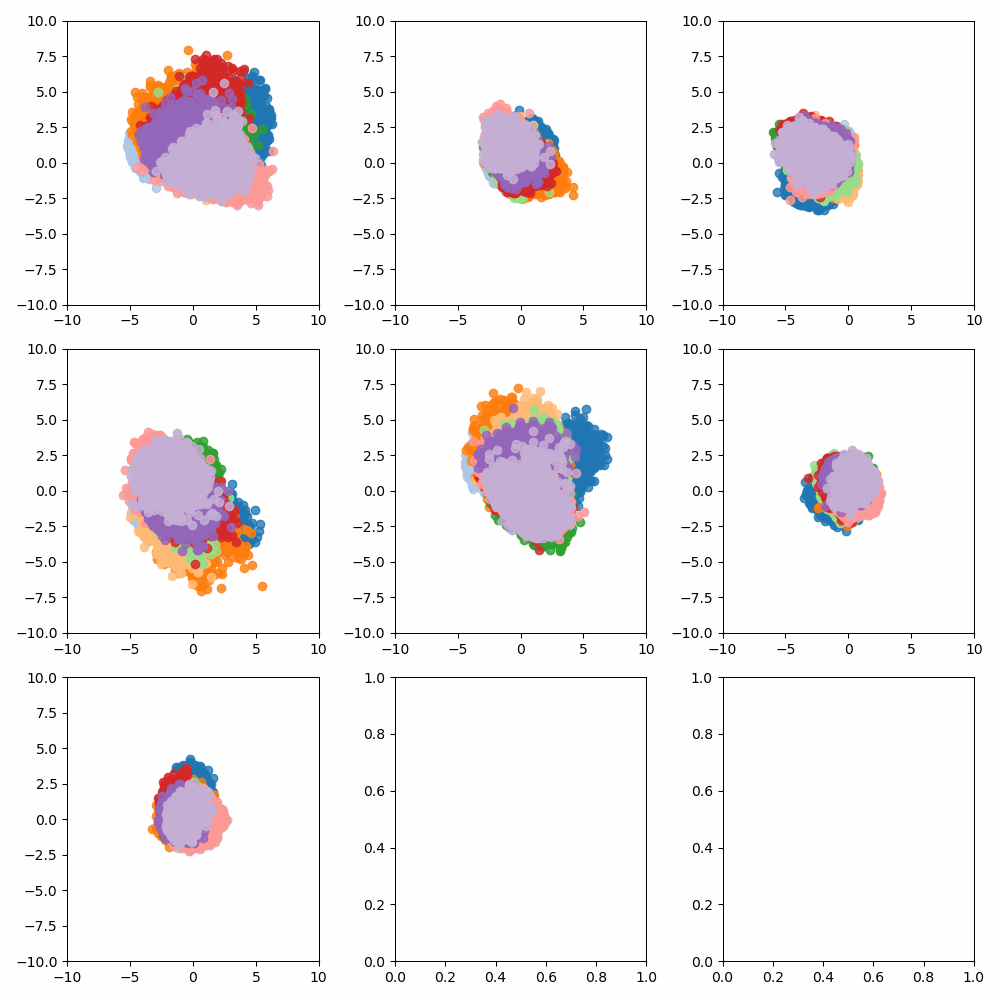
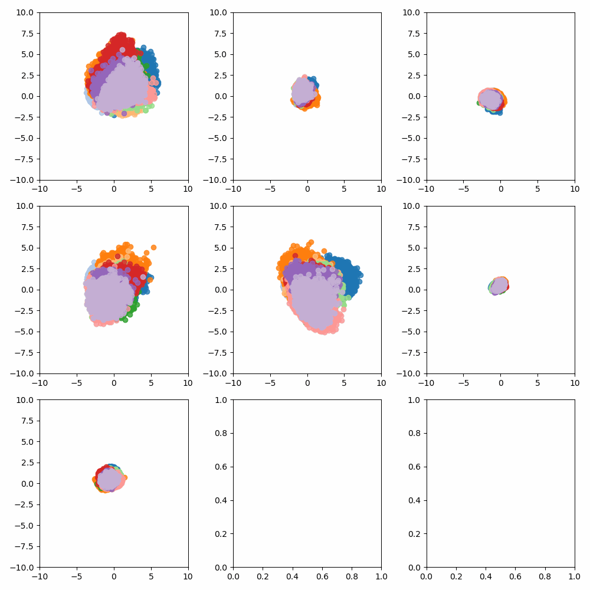
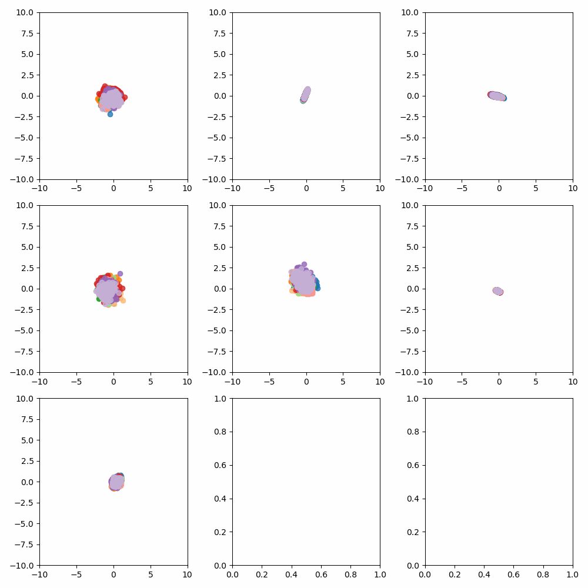

# Statistical machine learning course - GaTech
Authors: Zoe Fowler, Eloy Geenjaar, Jane Ivanova, and Jorge Quesada

## Representation figures

### Lambda = 0.0

### Lambda = 0.001

### Lambda = 0.005

### Lambda = 0.05

